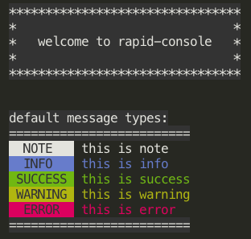

# rapid-console

[changlog>>>>](./CHANGELOG.md)

- simple, unique style console for command line tool.
- you need not to consider which color to set.



## install

```bash
npm i rapid-console -D
```

## usage

```js
const RConsole = require("rapid-console").default;

RConsole.note("ABC...");

//...
```

## API

### title(message)

console a title with outline

- message `string`

---

### note(message)

console a note message

- message `string`

---

### info(message)

console a info message

- message `string`

---

### success(message)

console a success message

- message `string`

---

### warning(message)

console a warning message

- message `string`

---

### error(message)

console an error message

- message `string`

---

### plain(message,[bgColor,fontColor])

console a plain message with custom color style

- message `string`
- bgColor `string`
- fontColor `string`

**note**: color must be one of these:
"black"
| "white"
| "green"
| "yellow"
| "blue"
| "red"
| "cyan"

### line(n)

console lines with no content

- n: `number`

### split(n,placeHolder)

- n: `number` the count of place holder, default is 20
- placeHolder: `string` place holder string, default is "\*"

## related

### [chalk](https://github.com/chalk/chalk)

### [chalk-animate](https://github.com/bokub/chalk-animation)
